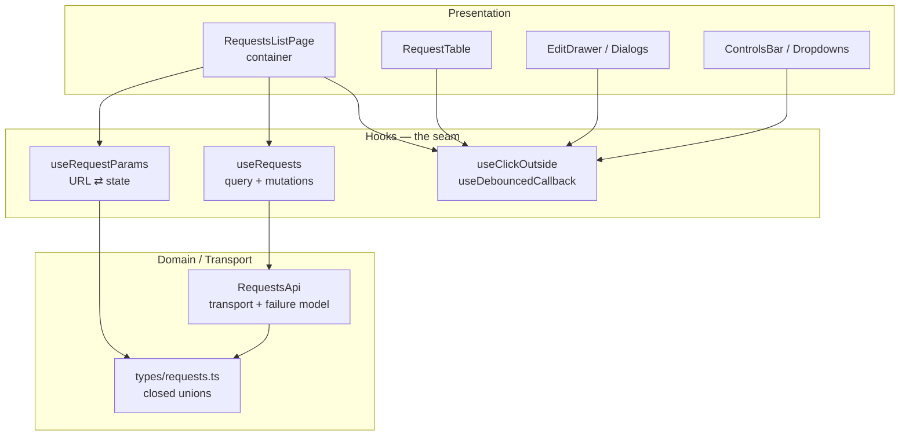
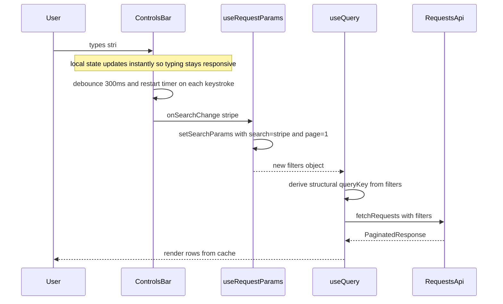

# Requests Management — Operational Dashboard

> An enterprise-grade reference implementation of a paginated, filterable, deep-linkable
> operations dashboard. Built to demonstrate production data-layer patterns: URL-driven state,
> server-state caching, optimistic concurrency, and unsaved-change protection.

[](https://react.dev)
[](https://www.typescriptlang.org)
[](https://vite.dev)
[](https://tanstack.com/query)
[](https://vitest.dev)
[](https://tailwindcss.com)
[](#8-testing)
[](#7-type-safety--compiler-enforcement)

---

[](https://requests-management-dashboard.vercel.app/)
[](https://github.com/HatemElnemr/requests-management-dashboard)

---

## Table of Contents

1. [Executive Summary](#1-executive-summary)
2. [Tech Stack](#2-tech-stack)
3. [Architecture](#3-architecture)
4. [Architectural Decisions & Trade-offs](#4-architectural-decisions--trade-offs)
5. [Key Features](#5-key-features)
6. [Project Structure](#6-project-structure)
7. [Getting Started](#7-getting-started)
8. [Testing](#8-testing)
9. [Type Safety & Compiler Enforcement](#9-type-safety--compiler-enforcement)
10. [Accessibility](#10-accessibility)
11. [Known Limitations & Future Work](#11-known-limitations--future-work)

---

## 1. Executive Summary

This project is a working operational dashboard for managing service requests. It is not a
static mockup: every control is wired, every state transition is real, and the concurrency
behaviour is deliberately non-trivial so that the hard parts of front-end data engineering are
visible and verifiable.

**What it demonstrates:**

| Capability | Implementation |
| --- | --- |
| Deep-linkable table state | `useRequestParams` — bidirectional sync between React state and URL query parameters |
| Server-state caching | TanStack Query v5 with background polling and structurally-derived cache keys |
| Optimistic concurrency | `onMutate` write-ahead, `onError` snapshot rollback, `onSettled` reconciliation |
| Loss-prevention | React Hook Form `isDirty` gating drawer dismissal + `beforeunload` guard |
| Input hardening | Every URL parameter is runtime-validated before it reaches the data layer |
| Network resilience | Simulated latency (500–1500 ms) and non-zero failure rates, handled gracefully in the UI |
| Verification | 132 automated tests across 8 files, validated by mutation testing |

**The central thesis** is that *table state is not component state*. Search, filters, sorting and
pagination are all derivable from the URL, which means the application state is serialisable,
shareable, bookmarkable, and survives a hard refresh — without a single line of Redux.

---

## 2. Tech Stack

All versions are the exact resolved versions in `package.json`.

| Layer | Choice | Version | Rationale |
| --- | --- | --- | --- |
| UI runtime | React | 19.3.0 | Concurrent rendering, `useId`, ref-as-prop |
| Language | TypeScript | 6.0.3 | `verbatimModuleSyntax`, `erasableSyntaxOnly` |
| Build | Vite | 8.3.1 | Native ESM, sub-second HMR, first-class SSR/CSR parity |
| Server state | TanStack Query | 5.103.2 | Cache, deduplication, retries, optimistic helpers |
| Routing / URL | React Router | 7.18.4 | `useSearchParams` for serialisable state |
| Forms | React Hook Form | 7.88.0 | Uncontrolled-first, built-in `isDirty`, resolver-ready |
| Styling | Tailwind CSS | 4.3.3 | CSS-variable theme, no runtime cost |
| Test runner | Vitest | 5.0.2 | Shares Vite's transform pipeline; no separate config |
| DOM test env | jsdom | 30.1.1 | Required by Testing Library |
| Testing Library | `@testing-library/react` | 16.3.3 | Behaviour-driven assertions, accessible queries |
| Linting | ESLint | 10.11.0 | Flat config, `react-hooks` v7 compiler rules |

> **Correction against a common assumption:** this project is built on **React 19** and
> **React Router 7**, not React 18 / Router 6. Router 7's `useSearchParams` retains the v6
> contract, so the idioms shown here port forward unchanged.

---

## 3. Architecture

### 3.1 Layering

The codebase enforces a strict one-way dependency rule. Lower layers never import from higher
ones.



### 3.2 Read path — one user action, one cache key



Three properties fall out of this design for free:

1. **Debouncing happens before the cache key is derived**, so a burst of keystrokes produces
   exactly one request rather than one per character.
2. **Cache keys are derived structurally**, so two different filter objects that represent the
   same query share one cache entry, and a changed filter is a guaranteed miss — which is what
   makes the optimistic/rollback path race-safe.
3. **Any refresh is a state change**, because the state *is* the URL.

### 3.3 Write path — optimistic update with rollback

All three mutations use an identical three-phase contract:

```ts
// src/features/requests/hooks/useRequests.tsx
export function useUpdateRequestStatus() {
  const queryClient = useQueryClient();

  return useMutation({
    mutationFn: ({ id, status }: { id: string; status: RequestStatus }) =>
      updateRequestStatus(id, status),

    // Phase 1 — WRITE AHEAD. Paint the intended state immediately.
    onMutate: async ({ id, status }) => {
      await queryClient.cancelQueries(invalidate());          // (a) stop in-flight writes
      const previous = queryClient.getQueriesData(invalidate()); // (b) snapshot for rollback

      queryClient.setQueriesData(invalidate(), (old) =>        // (c) apply optimistically
        old && { ...old, data: old.data.map((r) =>
          r.id === id ? { ...r, status, updatedAt: new Date().toISOString() } : r) },
      );

      return { previous };
    },

    // Phase 2 — REVERT on failure. The user was wrong; undo visibly.
    onError: (_error, _vars, context) => {
      context?.previous.forEach(([key, data]) => queryClient.setQueryData(key, data));
    },

    // Phase 3 — RECONCILE. The server is the source of truth; always re-read.
    onSettled: () => queryClient.invalidateQueries(invalidate()),
  });
}
```

Line `setQueriesData(invalidate(), …)` is the load-bearing detail. It is called with the
**prefix key** `["requests"]`, not the fully-qualified key, so the write lands on *every*
materialised page of the result set — otherwise editing a row on page 1 while page 3 stays
cached in memory would leave a stale duplicate.

The same contract is applied to `useUpdateRequest` (full field edits) and `useDeleteRequest`
(which additionally decrements `total` so the pagination footer stays truthful during the
optimistic window).

---

## 4. Architectural Decisions & Trade-offs

### 4.1 URL as the single source of truth — over Redux or local state

**Decision.** Search, status, priority, sort, page and limit are held in the URL query string.
React components hold *no* authoritative copy of table state.

```ts
// src/features/requests/hooks/useRequestParams.tsx (abridged)
const rawStatus = searchParams.get("status");

const filters: RequestFilters = {
  page:   positiveInt(searchParams.get("page"), 1),
  limit:  positiveInt(searchParams.get("limit"), 5),
  search: searchParams.get("search") ?? "",
  status:   isOneOf(STATUSES,   rawStatus) ? rawStatus   : "",
  priority: isOneOf(PRIORITIES, rawPriority) ? rawPriority : "",
  sortBy:   isOneOf(SORT_VALUES, rawSortBy) ? rawSortBy : DEFAULT_SORT,
};
```

| Approach | Deep link | Refresh | Back button | Boilerplate | Testability |
| --- | --- | --- | --- | --- | --- |
| Local `useState` | ✗ | ✗ | ✗ | low | easy |
| Redux + `redux-url-sync` | ✓ | ✓ | ✓ | **high** — 2 sources to keep in step | fair |
| **URL (chosen)** | ✓ | ✓ | ✓ | **low** — URL *is* the store | **easy** |

**Why this won.** The strongest argument is not the feature checklist — it is the *deletion* of a
whole category of bug. With duplicated state, every filter has two representations that can
disagree, and every code path that mutates one must remember to mutate the other. In the local-
state design, "filters reset to page 1" is a rule that must be re-implemented in five places. Here
it is a single unconditional line inside `setFilter`:

```ts
// Any filter change resets pagination. Enforced once, for all callers.
if (key !== "page") next.set("page", "1");
```

**Trade-off, stated honestly.** Writing to the URL on every filter change is a *navigation*
operation, and navigation is not free. Two consequences we had to design around:

- Because navigation re-renders the route, filter controls are uncontrolled locally and debounced
  upstream, so typing stays responsive without emitting a history entry per keystroke. All
  URL writes use `{ replace: true }` so the back button steps out of the dashboard rather than
  walking through intermediate search strings.
- We deliberately do **not** mirror the URL into React state. The filters object is rebuilt from
  the URL on every render, which makes a divergent local copy structurally impossible.

**One subtlety worth calling out:** the URL is *untrusted input*. `?status=bogus` is a perfectly
valid URL that would otherwise flow straight into the data layer and silently return nothing.
`isOneOf()` narrows each parameter against the closed unions in `types/requests.ts`; anything
unrecognised degrades to a safe default instead of corrupting the query. `?page=-4` and
`?page=abc` are rejected by `positiveInt`. This is covered by dedicated tests.

### 4.2 TanStack Query — over hand-rolled `useEffect` + `fetch`

**Decision.** All server state lives in the query cache, keyed by a structural descriptor of the
request.

**What this buys, specifically:**

- **Deduplication.** Ten components asking for the same filter set produce one network call.
- **Race-condition safety.** Keyed caching means an in-flight response for a stale filter can
  never overwrite a newer one — no sequence numbers or abort bookkeeping required.
- **Lifecycle management for free.** `refetchInterval: 10000` gives live-polling dashboards
  without a single `setInterval` or manual cleanup.
- **Mutations as a first-class concept,** with `onMutate` / `onError` / `onSettled` providing the
  exact three-phase seam the optimistic strategy needs.

**Trade-off.** It carries a real bundle cost and introduces a vocabulary (`queryKey`,
`invalidateQueries`, cache timeouts) that a reviewer must learn. For a two-endpoint app with no
polling, a `useEffect` would be less machinery. At this project's scale — five mutations, four
filter dimensions, background polling, and a rollback requirement — the library is a clear net
win. The deciding factor is that the *rollback* pattern in §3.3 is roughly 20 lines with the
cache API and would be a hand-built parallel cache registry without it.

### 4.3 Optimistic updates — and when *not* to use them

**Decision.** Apply optimistic writes for *status transitions and deletes*; do **not** apply them
to the full edit form.

**Why asymmetric.** Inline status changes are high-frequency, low-stakes, and trivially
reversible, so the perceived latency win is real and the blast radius is one badge. A multi-field
edit, by contrast, is a deliberate, considered act where showing a half-applied state across four
inputs is more confusing than a brief spinner — so the drawer waits for confirmation.

**How failure is surfaced.** Because the simulated mutation failure rate is 30% (see §5.5), the
failure path is a *first-class* code path, not a theoretical one:

```tsx
const statusMutation = useUpdateRequestStatus();

const handleStatusChange = (id: string, status: RequestStatus) => {
  statusMutation.mutate(
    { id, status },
    {
      onError: () => showToast("Could not update status. The change was reverted.", "error"),
      onSuccess: () => showToast("Status updated.", "success"),
    },
  );
};
```

The user sees the optimistic change, the change reverts, and a toast explains why. The three UI
states (optimistic, settled, reverted) are each covered by tests.

**Trade-off.** Optimistic updates make the UI temporarily disagree with the server, which is
exactly what makes them risky. They are only safe here because (a) the payload is a full
`RequestItem` so the cache is never left partially written, and (b) the server is reachable for
reconciliation, so `onSettled` always converges. Against a non-idempotent endpoint, we would
require an idempotency key and would narrow the optimistic surface to reversals only.

### 4.4 Debounced search — before the cache key, not after

**Decision.** 300 ms debounce, applied to the *commit* of the search value, with local input state
kept in sync immediately.

```ts
// src/hooks/useDebouncedCallback.ts (abridged)
const run = (...args: A) => {
  clearTimeout(timer.current);
  timer.current = setTimeout(() => savedCallback.current(...args), delay);
};
run.cancel = () => clearTimeout(timer.current);
```

Measured effect, typing the 6-character query `stripe`:

| | Requests issued | Values sent |
| --- | --- | --- |
| Without debounce | **6** | `s`, `st`, `str`, `stri`, `strip`, `stripe` |
| With debounce | **1** | `stripe` |

Two details that are easy to get wrong and are therefore tested:

- **The timer resets on every keystroke.** The `clearTimeout` before each `setTimeout` is what
  makes this a trailing-edge debounce rather than a throttle.
- **Clearing the field is not debounced.** Clearing is a deliberate single action, so it fires
  immediately — and calls `run.cancel()` first. Without that, a pending `"str"` search would fire
  300 ms later and resurrect a filter the user had just dismissed.

### 4.5 Derived state over duplicated state

Active filter chips are **computed** from the current filters, not stored:

```ts
const chips = useMemo<FilterChip[]>(() => {
  const list: FilterChip[] = [];
  if (filters.search)   list.push({ id: "search",   label: `Search: ${filters.search}` });
  if (filters.status)   list.push({ id: "status",   label: `Status: ${STATUS_LABELS[filters.status]}` });
  if (filters.priority) list.push({ id: "priority", label: `Priority: ${PRIORITY_LABELS[filters.priority]}` });
  return list;
}, [filters.search, filters.status, filters.priority]);
```

Chip removal is therefore a pure translation back into a `setFilter` call — there is no
chip-to-filter mapping to keep synchronised. Presentation labels (`"In Progress"`) are resolved
through `STATUS_LABELS` lookups, keeping the wire format `snake_case` while the UI stays
human-readable.

---

## 5. Key Features

### 5.1 URL-driven table state

Deep-linkable, bookmarkable, refresh-safe, back-button-correct. Every filter is a validated URL
parameter. `Clear all` resets to a clean query string; chip removal surgically deletes one
parameter; changing any filter resets `page` to 1 in exactly one place.

### 5.2 Asynchronous data handling

`useQuery` with a structural `["requests", filters]` key, `retry: 2`, and
`refetchInterval: 10000` for live-polling. Three distinct states are rendered deliberately:

| State | Presentation |
| --- | --- |
| First load, no data | Full-page skeleton with spinner |
| Background refetch, data present | Table stays; header shows a syncing indicator |
| First load failed | Blocking error state with **Try again** |
| Refetch failed, data present | Non-blocking amber banner; last good result retained |

The last row is the one most dashboards get wrong. A polling failure must never destroy data the
user is already reading.

> **Implementation note.** The fatal-error branch is gated on `isError && !data`, **not**
> `isError && isPending`. Under Query v5, `isPending` is `status === 'pending'` and becomes
> `false` the instant a query errors, so the `isPending` variant is unreachable — a subtle bug
> this test suite caught.

### 5.3 Optimistic updates with rollback

Status change, full edit, and delete all use the three-phase contract from §3.3, with
snapshot-based rollback and reconciliation invalidation. Covered by mutation-tested specs.

### 5.4 Unsaved-changes protection

`react-hook-form` owns the edit drawer's form state; `formState.isDirty` replaces hand-rolled
field comparison.

```tsx
function requestClose() {
  if (isDirty) setIsDiscardOpen(true);   // confirm before discarding
  else onClose();                        // clean: close immediately
}
```

Because the drawer *already knows* whether it is dirty, the confirmation dialog is owned by the
drawer. The parent container holds no `isDrawerDirty` state and no `onDirtyChange` plumbing.

Also included:

- **Validation** — title and owner are required; whitespace-only input is rejected separately from
  empty input. Invalid fields get `aria-invalid`, `aria-describedby`, and a red border.
- **`beforeunload` guard** — while dirty, tab close/reload prompts. Since filters live in the URL,
  navigating away is a real way to lose edits, so this is a genuine protection rather than a
  nicety.
- **Re-mount isolation** — the drawer is keyed by `request.id`, so `defaultValues` re-initialise
  per request and a 10-second background refetch can never clobber in-progress typing.

### 5.5 Simulated network conditions

The mock transport models a hostile network on purpose, so resilience is demonstrable rather
than claimed:

| Endpoint | Latency | Failure rate |
| --- | --- | --- |
| `fetchRequests` | 500–1500 ms | **5%** |
| `updateRequestStatus` | 500–1500 ms | **30%** |
| `updateRequest` | 500–1500 ms | **30%** |
| `deleteRequest` | 500–1500 ms | **30%** |

Rates are currently **hardcoded module constants**, not runtime-configurable — the deliberate
choice was to keep the failure model fixed and deterministic-by-assertion rather than tunable.
They are centralised in `simulateNetwork()` and were deliberately omitted from the shipped UI so
that every error path is exercised on every run.

### 5.6 Interaction quality

- **Three dropdown types** (filter, sort, inline status) with click-outside dismissal, `Escape`
  to close, focus containment, and full ARIA (`aria-haspopup`, `aria-expanded`, `aria-selected`,
  `role="listbox"` / `role="option"`).
- **Pagination** with a collapsing window (`1 … 4 5 6 … 10`), correct boundary states, and
  `aria-current="page"`.
- **Toasts** for success and failure, with auto-dismiss that survives parent re-renders.
- **Row action menu** with Edit and Delete.
- **Empty, loading, and error states** for the table.

---

## 6. Project Structure

```text
requests-management/
├── public/                              # Static assets (favicon, icon sprite)
├── src/
│   ├── main.tsx                         # React root, StrictMode
│   ├── App.tsx                          # QueryClientProvider + BrowserRouter composition
│   ├── index.css                        # Tailwind v4 theme via @theme inline
│   │
│   ├── components/                      # Shared, feature-agnostic UI
│   │   ├── layout/
│   │   │   └── Header.tsx               # App bar, avatar, sync indicator
│   │   └── ui/
│   │       ├── Avatar.tsx               # Initials + deterministic colour
│   │       ├── Dropdowns.tsx            # FilterDropdown + SortDropdown
│   │       ├── Pagination.tsx           # Windowed page list
│   │       └── Toast.tsx                # Dismissible, auto-expiring notice
│   │
│   ├── features/requests/               # Vertical slice — the domain
│   │   ├── api/
│   │   │   └── RequestsApi.tsx          # Transport contract + failure model
│   │   ├── components/
│   │   │   ├── RequestTable.tsx         # Table + row action menu
│   │   │   ├── RequestBadges.tsx        # Status / priority visual mapping
│   │   │   ├── InlineStatusSelect.tsx   # Per-row status dropdown
│   │   │   ├── ControlsBar.tsx          # Search + filters + sort (debounced)
│   │   │   ├── ActiveFilters.tsx        # Removable filter chips
│   │   │   ├── EditDrawer.tsx           # RHF form, dirty guarding, validation
│   │   │   └── DiscardDialog.tsx        # Discard confirmation
│   │   ├── data/
│   │   │   └── MockRequests.ts          # Seed data, label maps, sort ordering
│   │   ├── hooks/
│   │   │   ├── useRequestParams.tsx     # URL ⇄ filter state + validation
│   │   │   └── useRequests.tsx          # useQuery + 3 optimistic mutations
│   │   ├── pages/
│   │   │   ├── RequestsListPage.tsx     # Container: composes everything
│   │   │   └── RequestsListPage.test.tsx
│   │   └── types/
│   │       └── requests.ts              # Closed unions & domain interfaces
│   │
│   ├── hooks/                           # Cross-cutting primitives
│   │   ├── useClickOutside.ts           # Outside-click + Escape dismissal
│   │   └── useDebouncedCallback.ts      # Trailing-edge debounce with .cancel()
│   │
│   └── test/                            # Colocated test suite
│       ├── utils.tsx                    # QueryClient + MemoryRouter harness
│       ├── factories.ts                 # Domain object builders
│       ├── RequestsApi.test.ts          # 31 tests
│       ├── EditDrawer.test.tsx          # 25 tests
│       ├── RequestsListPage.test.tsx    # 19 tests
│       ├── Dropdowns.test.tsx           # 16 tests
│       ├── Pagination.test.tsx          # 15 tests
│       ├── Filters.test.tsx             # 14 tests
│       ├── ControlsBar.test.tsx         #  8 tests
│       └── requests.test.ts             #  4 tests
│
├── eslint.config.js                     # Flat config, react-hooks v7
├── vite.config.ts                       # Plugins, @ alias, Vitest environment
├── tsconfig.app.json                    # Application compilation
├── tsconfig.node.json                   # Build-tooling compilation
└── package.json
```

**Why a vertical slice?** `features/requests/` owns its API, hooks, components, data and types
together. A component can only be imported by knowing which feature owns it, so a change to the
request contract is contained to one subtree, and deleting the feature is a single directory
removal. `components/` and `hooks/` hold only code that is genuinely domain-agnostic.

---

## 7. Getting Started

### Prerequisites

| Tool | Version | Notes |
| --- | --- | --- |
| Node.js | `^20.19.0 \|\| >=22.12.0` | Declared engine requirement of Vite 8 |
| npm | ≥ 10 | Any lockfile-compatible client |

> Node 18 is **not** supported — Vite 8 requires Node 20.19+ or 22.12+. Note this is not a simple
> "≥ 20.19": Node 21 satisfies neither range, so use 20.19+ or 22.12+.

### Installation

```bash
git clone <repository-url>
cd requests-management
npm install
```

### Available scripts

| Command | Purpose |
| --- | --- |
| `npm run dev` | Vite dev server with HMR at `http://localhost:5173` |
| `npm run build` | Type-check via project references, then production build |
| `npm run preview` | Serve the built `dist/` locally |
| `npm run lint` | ESLint across the workspace |
| `npm test` | Vitest in watch mode |
| `npm test -- --run` | Single CI-style run |
| `npm test -- --coverage` | Coverage report *(requires `@vitest/coverage-v8`)* |

`npm run build` runs `tsc -b` **before** bundling, so a type error fails the build rather than
shipping. This is enforced by the build script, not by convention.

### Configuration notes

- **Path alias.** `@/*` → `src/*` is declared in `tsconfig.app.json` **and** mirrored in
  `vite.config.ts`. Both are required: TypeScript needs the mapping to resolve types, and Vite
  needs it to resolve modules at runtime. Relying on a single source here causes dev-server
  failures that a production build silently tolerates.
- **Test environment.** `vite.config.ts` sets `test.environment: "jsdom"` and `globals: true`.
  `defineConfig` is imported from `vitest/config` so the `test` block is type-aware; the same
  config remains valid for `vite build`.

---

## 8. Testing

**132 tests across 8 files**, executing in roughly 4 seconds.

```bash
npm test -- --run
```

| Suite | Tests | Focus |
| --- | --- | --- |
| `RequestsApi.test.ts` | 31 | Search, filters, all 4 sort orders, pagination boundaries, mutations, rejection paths |
| `EditDrawer.test.tsx` | 25 | Dirty tracking, revert, close guards, validation, save payload integrity |
| `RequestsListPage.test.tsx` | 19 | Container integration: rows, paging, filters, row actions, error states |
| `Dropdowns.test.tsx` | 16 | Open/close, selection, outside-click, `Escape`, ARIA state |
| `Pagination.test.tsx` | 15 | Page window and ellipsis, boundary disabled states |
| `Filters.test.tsx` | 14 | Chip removal, clear-all, inline status select, discard dialog |
| `ControlsBar.test.tsx` | 8 | Debounce behaviour and request volume |
| `requests.test.ts` | 4 | URL hook sync, query fetching, optimistic rollback |

### Determinism as a design constraint

Tests are only useful if they are reliable. Three sources of non-determinism were removed:

1. **Random failures and latency.** The transport seeds from `Math.random`, so the suite pins it
   and drives the timers:

   ```ts
   vi.useFakeTimers();
   vi.spyOn(Math, "random").mockReturnValue(0.9); // ≥ every failureRate ⇒ always succeeds
   vi.resetModules();                            // fresh module ⇒ fresh seed data
   api = await import(".../RequestsApi");        // per-test isolation
   await vi.advanceTimersByTimeAsync(2500);      // flush simulated latency
   ```

2. **Shared mutable seed data.** `INITIAL_MOCK_REQUESTS` is mutated by the API's write methods.
   `vi.resetModules()` plus a dynamic import gives each test its own copy, so mutation tests
   cannot leak into neighbours.

3. **Async form submission.** React Hook Form's `handleSubmit` is asynchronous; assertions made
   synchronously after a click observe a pre-commit state. Interactions are wrapped:

   ```ts
   const click = (el: Element) => act(async () => { fireEvent.click(el); });
   ```

   This is a common source of false negatives in form tests and is worth stating explicitly.

### Mutation testing — are these tests actually load-bearing?

A green suite proves little on its own: a test can pass for the wrong reason. The suite was
validated by deliberately breaking the implementation and confirming the suite reacts. Each
mutation asserts that its patch applied, so a silent no-op cannot masquerade as a result.

| Injected regression | Result |
| --- | --- |
| Search stops matching request ID | **caught** (2 tests fail) |
| Search stops matching owner | **caught** (2 tests fail) |
| Priority sort stops ordering urgent first | **caught** |
| Pagination ignores the page offset | **caught** (3 tests fail) |
| Drawer stops blocking an empty title | **caught** (2 tests fail) |
| Drawer stops guarding unsaved changes | **caught** (4 tests fail) |
| Revert stops restoring defaults | **caught** |
| Pagination window stops collapsing pages | **caught** |
| Dropdowns stop closing on outside click | **caught** (3 tests fail) |
| Search debounce removed entirely | **caught** (4 tests fail) |
| Optimistic update disabled | **caught** |
| Rollback disabled | **caught** |

One regression was caught *because* of this exercise rather than by a test: the rollback
assertion was initially vacuous. `onSettled` triggers a refetch, and because the mocked `fetch`
returned the original row, the assertion passed even with `onError` entirely removed. The refetch
was made to hang so that the observed value could only originate from the rollback itself.

### Testing conventions

- **Query by role and accessible name**, not by class or test id — the same queries double as an
  accessibility audit.
- **No `jest-dom` dependency.** Assertions use plain DOM APIs (`el.disabled`,
  `el.getAttribute`, `container.innerHTML`) to keep the dependency surface minimal.
- **Behaviour over implementation.** No component snapshots; every assertion describes what a user
  can observe.

---

## 9. Type Safety & Compiler Enforcement

The domain model is built on **closed unions**, which is what makes URL validation and exhaustive
switching possible:

```ts
// src/features/requests/types/requests.ts
export type RequestStatus = "open" | "in_progress" | "completed" | "canceled";
export type RequestPriority = "low" | "medium" | "high" | "urgent";
export type RequestSortBy = "createdAt" | "updatedAt" | "priority" | "status";
```

A typo such as `status: "in_progres"` is a compile error, not a silently empty result set. The
same unions drive the runtime guards, so the type and the validator cannot drift:

```ts
function isOneOf<T extends string>(list: readonly T[], value: string | null): value is T {
  return value !== null && (list as readonly string[]).includes(value);
}

status: isOneOf(STATUSES, rawStatus) ? rawStatus : "",
```

`isOneOf` is a genuine type predicate: in the true branch `rawStatus` narrows to `RequestStatus`,
so no cast is required.

### `verbatimModuleSyntax`

This flag makes the type/value distinction in imports **syntactic and unforgeable**. With it
enabled, TypeScript preserves the import exactly as written and errors on elision that would
change runtime behaviour:

```ts
// Correct — erased at compile time, never shipped
import type { RequestItem, RequestStatus } from "@/features/requests/types/requests";
import { STATUS_LABELS } from "@/features/requests/data/MockRequests";

// Wrong — a *value* import of a type-only module, which survives compilation
// and fails at runtime with "does not provide an export named 'RequestItem'"
import { RequestItem } from "@/features/requests/types/requests";
```

Why this matters in a project with a mock transport: the boundary between a *type* and a *runtime
value* is exactly where mock/stub modules get swapped. `verbatimModuleSyntax` turns a class of
silent bundler bugs into compile errors. It also means type imports cost zero bytes and cannot
accidentally create a circular runtime import.

The discipline is enforced by the compiler, not by review comments.

### Enforcement summary

| Flag | Effect in this project |
| --- | --- |
| `verbatimModuleSyntax` | Type-only imports must be marked; no accidental elision |
| `erasableSyntaxOnly` | No `enum` / parameter properties — keeps output transform-safe |
| `noUnusedLocals` | Dead code fails the build; caught several unused-import slips |
| `noUnusedParameters` | Same, for parameters |
| `noFallthroughCasesInSwitch` | Guards the `sortBy` dispatch |
| `moduleDetection: "force"` | Every file is a module, regardless of `export` presence |
| `allowImportingTsExtensions` | Extensionless relative imports resolve under bundler mode |
| `jsx: "react-jsx"` | Automatic runtime; `React` need not be in scope |
| `noEmit` + project references | `tsc -b` type-checks without emitting |

> **Known gap, stated plainly:** `strict` is **not** enabled in `tsconfig.app.json`. The project
> runs with the linting flags above but without `strictNullChecks` / `noImplicitAny`. This was
> inherited from the scaffold and is the single highest-value change available — see
> [§11](#11-known-limitations--future-work).

---

## 10. Accessibility

Accessibility is treated as a requirement, not a pass at the end. The suite asserts accessible
state wherever it exists, which means the queries themselves verify it.

| Concern | Approach |
| --- | --- |
| Dropdowns | `aria-haspopup="listbox"`, `aria-expanded`, `aria-controls`, `role="listbox"`/`option`, `aria-selected` |
| Drawer / dialogs | `role="dialog"` + `aria-modal`, or `role="alertdialog"` for the destructive confirm |
| Forms | `<label for>` association, `aria-invalid`, `aria-describedby` to the error node |
| Errors | `role="alert"` / `role="status"` with `aria-live`, so failures are announced |
| Status button | Explicit `aria-label="Change status, currently Open"` — the visible badge alone is not a sufficient accessible name |
| Pagination | `aria-current="page"` on the active page; `aria-label` on prev/next |
| Keyboard | `Escape` dismisses every overlay; outside-click dismissal never traps focus |

---

## 11. Known Limitations & Future Work

Documented deliberately: an honest gap list is more useful to a reviewer than an implied
completeness.

**Correctness / robustness**

1. **`strict` is not enabled.** The single highest-value improvement. Expect a non-trivial
   migration, mostly around `null` narrowing on the query result and on `document.getElementById`.
2. **`retry: 2` delays the first-load error state by ~3 s** (exponential backoff: 1 s + 2 s).
   Correct for the 5% random failure, poor UX for a genuine outage. Recommend `retry: 1` with a
   capped `retryDelay`, or a manual-retry-only policy.
3. **Mutations are not idempotency-keyed.** Safe against a mock transport; a real backend would
   need keys to make optimistic retries safe.
4. **`refetchInterval: 10000` polls unconditionally**, including while a mutation is in flight.
   `refetchIntervalInBackground: false` and pausing on mutation would reduce redundant traffic.
5. **No `placeholderData`.** Paging between filter sets drops to a full loading state. Keeping the
   previous page visible via `placeholderData: keepPreviousData` would remove the flash.

**Functionality**

6. **No server-side persistence.** The mock store resets on reload, and deletions/status changes
   are lost.
7. **No virtualisation.** The table renders the current page only, so this is not yet a problem;
   raising `limit` significantly would need windowing.
8. **Single route.** The URL contract is designed for a route to grow, but only `/` exists.
9. **Header avatar is inert.** A user menu is the natural next step.

**Engineering**

10. **No CI pipeline.** `tsc -b && eslint && vitest --run` is the exact gate to enforce on every push.
11. **No coverage threshold.** The suite was validated by mutation testing, which is stronger, but
    a coverage floor would catch untested *new* files.
12. **Failure rates are hardcoded.** An env-gated override (`VITE_API_FAILURE_RATE`) would let CI
    exercise error paths deterministically without touching code.

---

<div align="center">

**Built as an engineering evaluation submission.**
Demonstrating that data-layer correctness — not visual polish — is the hard part of frontend work.

</div>
